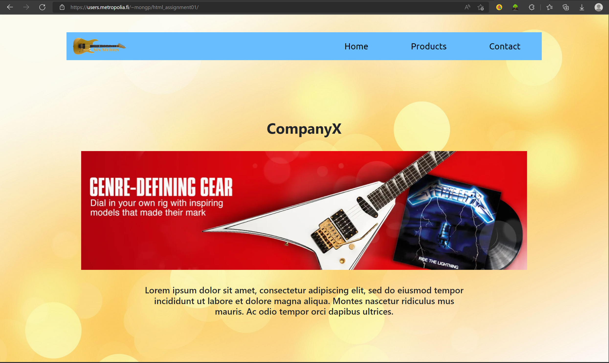

# Web_assignment
## How to transfer html project files to metropolia server (publish website using metropolia server)
1. Download and install FileZilla client
2. Launch FileZilla
3. From File -> Site Manager -> Add new site with required information:
  - Protocol: SFTP
  - Host: shell.metropolia.fi
  - Port: 22
  - User: your metropolia ID
  - Password: your metropolia password
  
  
4. Connect to server
5. Create new folder under: yourID -> public_html

6. Drag all html project files to this subfoler

7. Check your published website: users.metropolia.fi/~yourID. Click to the folder name that you have created in step 5.

